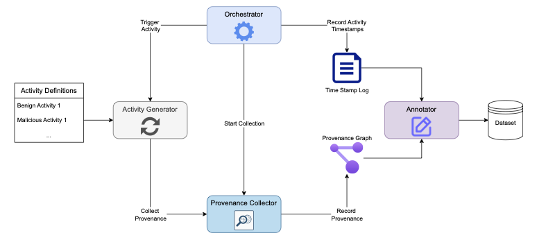

# 5GProvGen
This repository is the codebase associated with the paper titled "5GProvGen: 5G Provenance Dataset Generation Framework" 

## Dataset Access
Our dataset is hosted on IEEE Dataport and can be accessed [here](https://ieee-dataport.org/documents/5gprovgen#files)

## Framework


In this repo we present our framework 5GProvGen. Our repository consists of 4 components:
1. Orchestrator 
2. Collector
3. Activity Generator 
4. Annotator

## Prerequisites 
### Installing Camflow
For installing the collection framework, we rely on CamFlow dev guide. That's cause camflow originally support ... while our testbed can only be installed on ubuntu. Therefore we relied of camflow vagrant guide. 

### Setting Open5GS
We rely on the testbed automator, it's a one script that's thoroughly documented in the open5gs-k8s [repo](https://github.com/niloysh/open5gs-k8s/).

### Setting up conda environment
Each of the models has its own condo environment as well as our collection frame work. Please setup your conda environment and install all the dependencies.

## Running collection
For running the collection you can either run each of the components separately in a different shell, or you can let our orchestrator manage the environment for you. 
Simply run 
```
python orchestrator.py
```
You must make sure to run the orchestrator as root. Managing camflow and simulating our attacks requires admin privileges. 